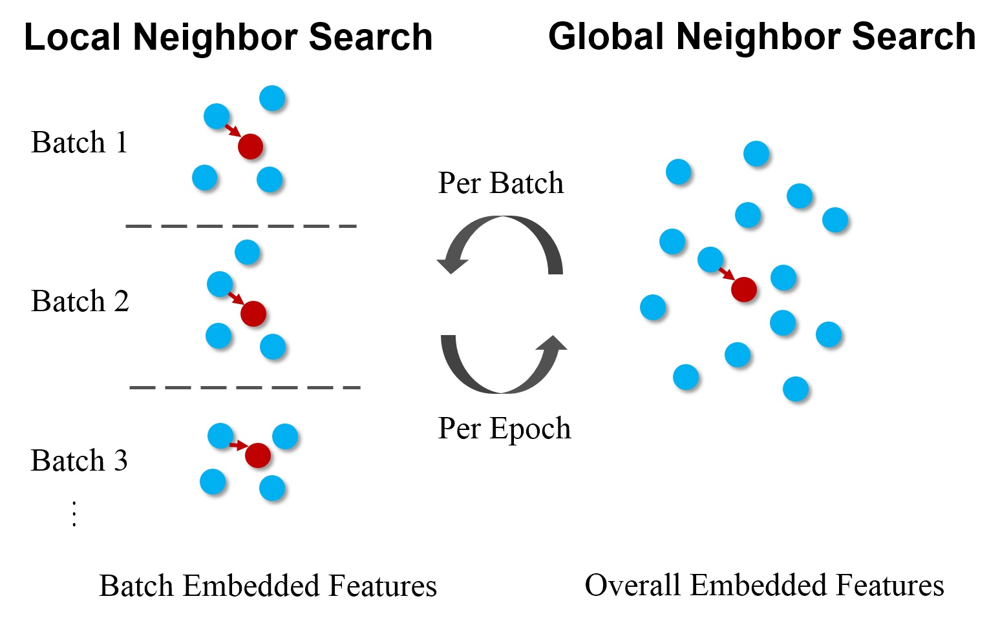
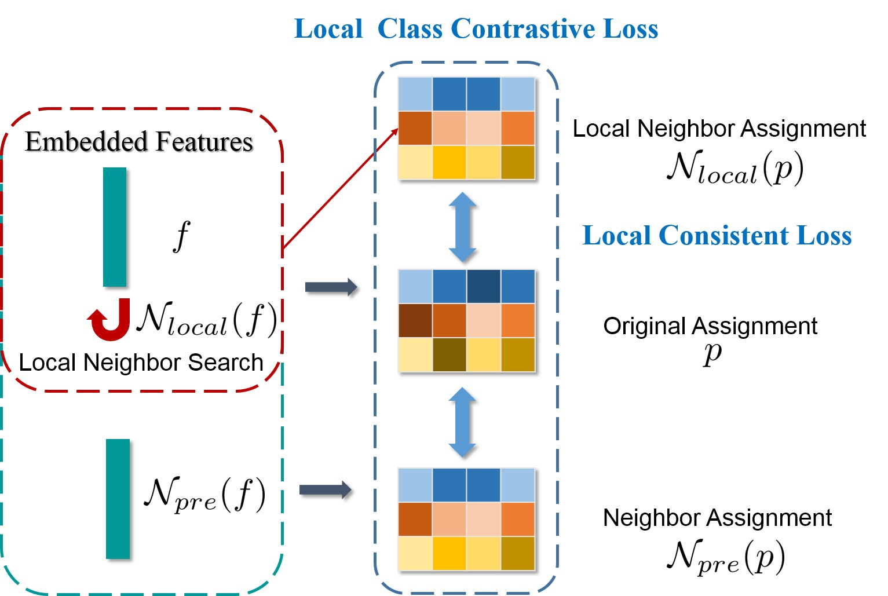
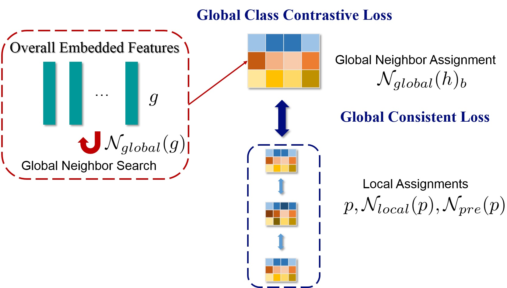
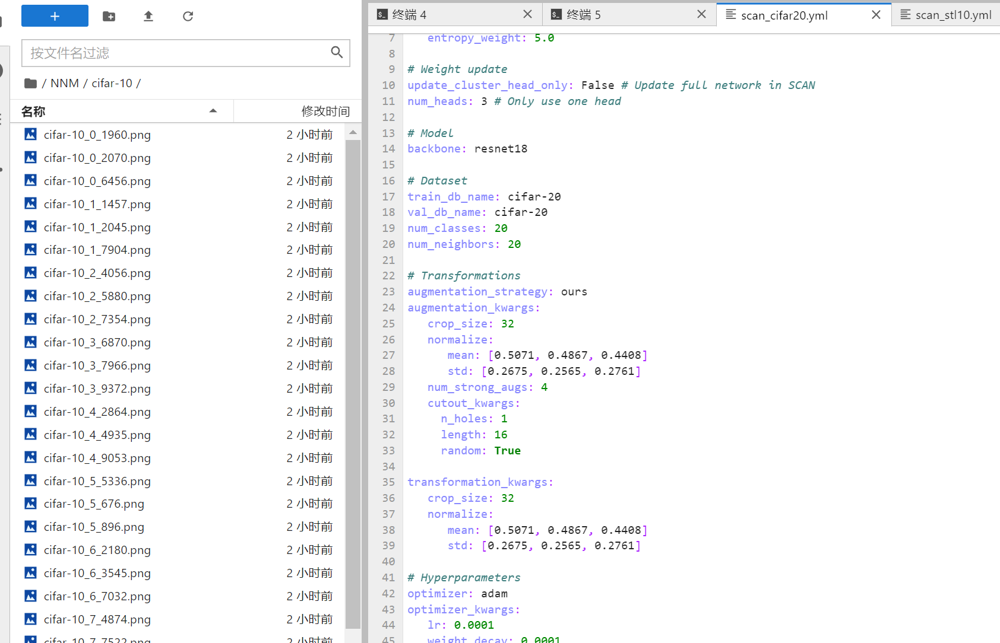

# NNM Replication
NNM: Nearest Neighbor Matching for Deep Clustering.
GitHub link：https://github.com/ZhiyuanDang/NNM/blob/main/README.md

# Introduction

 The illustration of our idea. We propose to match more semantically nearest neighbors from between <b>local (batch)</b> and <b>global (overall)</b> level. Benefit from the dynamic updated deep features with iteration and epoch increases, we can construct more and more semantically confident sample pairs from samples and its neighbors. 

# Framework
Local Nearest Neighbor Matching

Global Nearest Neighbor Matching

For specifical loss, please refer [paper](./dzy-CVPR2021-NNM-final.pdf) and [poster](./4001-poster.pdf).

# Pre-Trained Models
|  Models    | Links |
|  ----   | ---- |
| CIFAR-10   | [Google Drive](https://drive.google.com/file/d/1Wk3wJZ1puU8ptAaMgLOhviG54ooGMXPf/view?usp=sharing) |
| CIFAR-20   | [Google Drive](https://drive.google.com/file/d/1GELVDCmompIT12iKv-Ib4SBNnfohmUTH/view?usp=sharing) |
| STL-10   | [Google Drive](https://drive.google.com/file/d/1ZK5zs6jfjm6_CCm4gf6Ji0gGGrQCc0bk/view?usp=sharing) |

# Trained Models
|  Models   | ACC  | Links |
|  ----  | ----  | ---- |
| CIFAR-10  | 0.8430 | [Google Drive](https://drive.google.com/file/d/1_7tua1Sam5T1s9fhopAw3buIBLrnI3dy/view?usp=sharing) |
| CIFAR-20  | 0.4773 | [Google Drive](https://drive.google.com/file/d/1-kqS3Myrw6S1Y9O0kjsHB3kiCv1_d-yw/view?usp=sharing) |
| STL-10  | 0.8084 | [Google Drive](https://drive.google.com/file/d/1aC4aKkoRO2kKAQv1COYcucqRcZ6rdk59/view?usp=sharing) |

# Run
## Requirements
Python 3.7 and Pytorch 1.4.0 are required. Please refer to requirements.txt for more details.
## Usages

1. Clone this repository: `git clone https://github.com/ZhiyuanDang/NNM.git`.

Navigate to the directory: `cd NNM`.

Supported datasets: [CIFAR-10/100], [STL-10].

Note: Adjust the yml file in the config_exp path according to your GPU settings, specifically the `batch_size`.

2. You can directly use the pre-trained models from [SCAN](https://github.com/wvangansbeke/Unsupervised-Classification). Then, generate the features with the following code (for CIFAR-10):

`python simclr.py --config_env configs/env.yml --config_exp configs/pretext/simclr_cifar10.yml`.

3. Next, run the clustering step (optional): 

`python scan.py --config_env configs/env.yml --config_exp configs/scan/scan_cifar10.yml --gpus 0 (--seed 1234)`.

4. To visualize the top k images, set the `--visualize_prototypes` flag. For example, on CIFAR-10:
`python eval.py --config_exp configs/scan/scan_cifar10.yml --model $MODEL_PATH --visualize_prototypes`.
The command for replication is: `python eval.py --config_exp configs/scan/scan_cifar10.yml --model /root/NNM/Trained_Models/cifar10.pth.tar --visualize_prototypes`.

## Reference

SpCL (https://github.com/yxgeee/SpCL)
